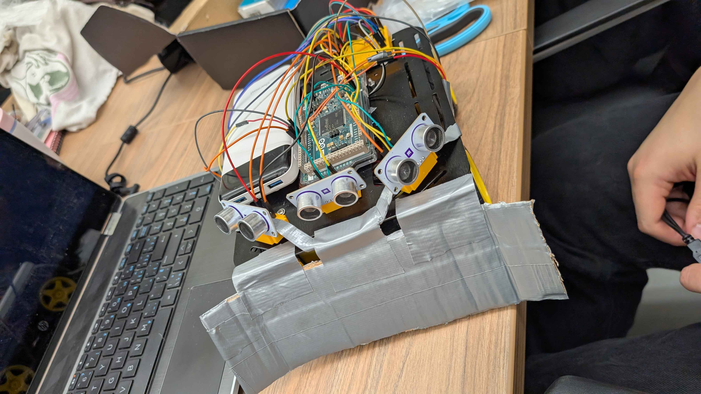

# Autonomous Snowplow Robot (SYSC 4805)
**Role:** Hardware Wiring, System Integration & RTOS Designer
**Group:** 18 (Team Maroon)
**Hardware:** Arduino Due, Cytron Driver, 3 Ultrasonic Sensors, 2 IR Line Sensors
**Firmware:** C++ (FreeRTOS & Sequential versions)

## 1. Project Overview
This project involved the design and implementation of an autonomous robot tasked with clearing "snow" (small wooden blocks) from a defined arena.
* **Objective:** Clear a 100cm x 100cm enclosed space of 100 wooden cubes within 5 minutes.
* **Constraints:** The robot must remain within black tape boundaries and avoid larger static obstacles placed around the perimeter.

## 2. My Technical Contributions
My primary role was **System Integration** and **Firmware Architecture**. I was responsible for connecting the individual sensor/hardware modules into a cohesive system and implementing the Real-Time Operating System (RTOS).

### Key Responsibilities
* **Hardware Integration:** Wired and integrated the Ultrasonic sensors, Line Detectors, and Motor Drivers to the Arduino Due, managing power distribution and signal integrity.
* **Program Logic Implementation:** Integrated all sensor and motor code into a single file and designed the sequential control loop to avoid obstacles and stay within the perimeter.
* **RTOS Implementation:** Migrated the system from a sequential loop to **FreeRTOS** to ensure deterministic timing. This allowed the robot to poll sensors and control motors concurrently without blocking execution.

## 3. Demonstration Performance Results
Both demonstrations were conducted using the RTOS implementation of the firmware.

| Metric | Attempt 1 | Attempt 2 |
| :--- | :--- | :--- |
| **Blocks Cleared** | **32 / 100** | **20 / 100** |
| **Obstacle Collisions** | 2 | 5 |
| **Configuration** | Higher Ultrasonic detection distance. | Reduced Ultrasonic detection distance. |

**Discussion:** 
* **Line Sensor Variance:** While the line sensors functioned as intended, they sometimes suffered from false positives due to the low contrast of the arena's more grey floor (as opposed to the white test surfaces). Additionally, despite identical mounting heights, the two sensors showed significant variance, outputting different analog values for the same surface. We prioritized not leaving the boundaries and so the threshold set was low, resulting in the right sensor which was consistently higher to trigger the turning algorithm.
* **Ultrasonic Signal Noise:** The ultrasonic sensors were the main source of instability. They were prone to false positives, being the primary reason for Attempt 2 going poorly. When we reduced the minimum detection distance to try and clear blocks closer to obstacles, the sensors began triggering on background noise. This caused the robot to frequently enter "avoidance mode" loops even when no obstacle was present, it would also sometimes not even detect something right in front of it resulting it clipping the obstacles more often.
* **Pathing Constraints:** The motor control logic was simplified to execute unidirectional turns (always turning right) when an obstacle or line was detected. While this kept the logic simple and robust, it limited the robot's pathing efficiency. It often took longer to navigate out of corners compared to a bi-directional turning algorithm.

## 4. System Architecture
The final version utilizes **FreeRTOS** to manage three concurrent tasks:
1.  **SensorTask (High Priority):** Polls Ultrasonic and Line sensors at 50Hz; updates a shared data structure protected by a Mutex to prevent race conditions.
2.  **MotorTask (Medium Priority):** Consumes sensor data to drive the H-Bridge; executes avoidance maneuvers when safety thresholds are breached.
3.  **WatchdogTask (Highest Priority):** A supervisor task that monitors system health. It "kicks" the hardware watchdog only if all other tasks report their active status bitmasks, ensuring the system auto-resets if a task hangs.
